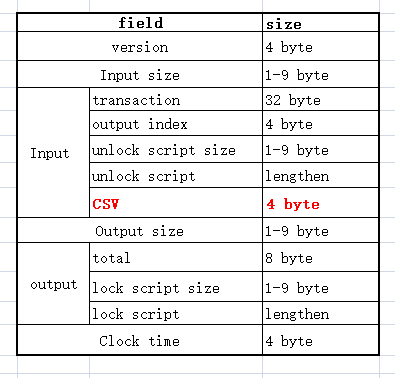

#Why is TFSC used?

### What is TFSC?

In short, TFSC is a completely decentralized public chain that anyone can read, send transactions, confirm transactions, and participate in. Its characteristic is: through the lightweight Raindrop Consensus protocol and special chain structure, it realizes the ability of multiple block producers to process blocks in parallel, making a great breakthrough in the scalability and performance of TFSC.

### TFSC advantages
To meet the above requirements, TFSC focuses on the following core concepts:
1. **Speed:** TFSC is written in C/C++. It has been proved that C/C++has good cross-platform performance and high operating efficiency. In TFSC, the transaction uplink speed is very fast, and the consensus of the whole network can be reached within 1 second.
2. **Security:** In the consensus layer,TFSC has adopted a large number of VRF protocols, Byzantine mechanism, 5519 conic signature algorithm and self-developed Raindrop Protocol. At the same time, under the premise of ensuring security, each node has the same status and rights. Even if some nodes have problems, it will not cause great impact.
3. **Scalability:** ensure that the TFSC network can handle the number of transactions due to the growth of user’s demand. Scalability also provides higher bandwidth capabilities to allow transactions to carry a large amount of easy-to-manage supporting data. In order to meet these requirements in the network, multiple side chain functions will be started using.
4. **Highly customized:** the business chain can operate independently according to different transaction types or business entities. The main network of TFSC is powerful, and the application range can be expanded indefinitely.
5. **Tamper resistant:** TFSC is a highly decentralized distributed ledger, and it is almost impossible to tamper with data.
6. **All data are open and transparent:** although all nodes in the public chain join the network anonymously, any node can view the account balance and transaction activities of other nodes. Verification nodes are distributed all over the world, and all people participate in bookkeeping and maintaining all data on the blockchain.
7. **Support for smart contracts:** At present, TFSC fully supports EVM, which can be understood as: smart contracts deployed by Ethereum can be executed on TFSC without modification or with a few modifications. TFSC will support wasm virtual machine contract in the near future.

#Compilation&Deployment 

###Setting up the development environment
The following software packages need to be installed:

- gcc (v9.3)
- cmake(v3.21)
- git 
- unzip 
- zip
- autoconf 
- automake 
- libtool
- perl-IPC-Cmd


Dependent Libraries:

- zlib 
- zlib-devel

Orders:

```
yum install -y zlib zlib-devel  
yum install -y unzip zip  
yum install -y autoconf automake libtool
yum -y install perl-IPC-Cmd
yum install -y devtoolset-9-toolchain
scl enable devtoolset-9 bash 
```
`scl enable devtoolset-9 bash ` is used to set ’ gcc’ tool chain todevtoolset-9

CMake upgrade(Note: The CMake version should be at least 3.15. x and the recommended version is 3.21. x)
```
curl -O https://cmake.org/files/v3.21/cmake-3.21.4.tar.gz
tar zxvf cmake-3.21.4.tar.gz
cd cmake-3.21.4
./configure 
gmake && make install
```

###Program compilation

Getting source code
```
git clone https://github.com/TFSC-Transformers/TFSC
```
Compiling

Follow the readme.md document
```
cd XXX
mkdir build
cmake .. && make
```

The program will generate relevant files in the bin directory after compilation.
Verify the centos server time(Ensure that the time of each node is the same and that the transaction is reliable when it is linked)

``` 
1. Install NTP
sudo yum -y install ntp

2. Use ntpdate to test NTP
ntpdate pool.ntp.org

3. check sever time
date

4. Start ntpd daemon for calibration time
systemctl start ntpd

5. Check whether the ntpd daemon is started
systemctl status ntpd

```


###Deploy nodes

Add parameter [- c ] when starting the program ,and the configuration file
will be automatically generated.
```
cd bin
./XXXX -c 
```

Modify config.json

```json
{
    "http_callback": {
        "ip": "",
        "path": "",
        "port": 0
    },
    "http_port": 11190,
    "info": {
        "logo": "",
        "name": ""
    },
    "ip": "",
    "log": {
        "console": false,
        "level": "OFF",
        "path": "./logs"
    },
    "rpc": true,
    "server": [
        "13.52.162.66",
        "52.52.118.136"
    ],
    "server_port": 41516,
    "version": "1.0"
}

```

`"server" field:`This field fills in any ip node in the TFSC network

`"server_port"field:`This field is the network connection port number (it does not need to be changed by default)

`"Log" field:"Console"` indicates whether the log is output on the screen;"Level" indicates the level of output log;"Path" indicates the path of the default log generation.

`"Ip":` the system will detect the local ip and automatically fill in this field when starting.

`"Http_port":` the port of the http service.

`"Rpc":` the switch of the access interface, the interface can be accessed when it is turned on, and it is turned off by default.

`"Info":` the logo and name of the node set by the user.

`"Http_callback":` httpcallback interface.

`"Version":` the version of the config file.

| Files or directories | Type     | Description                          |
| ----------- | -------- | ------------------------------------------ |
| cert  | folder |Store the generated private key with the suffix ". private" as a private key file |
| data.db | folder   | Store database file                          |
| logs  | folder   |  Store log file                             |
| config.json |json file | configuration file         |

###Start the program

Add parameter[ -m ] to start the program to display menu

```shell
./XXXX -m 
```
Note: The functions of the menus,including deployment and execution menu of smart contract

| Order         | Menu Items       | Function                  |
| ----          | ---------------- | --------                  |
| 1             | Transaction      | Transaction               |
| 2             | Stake            | Stake                     |
| 3             | Unstake          | disinvest                 |
| 4             | Invest           | Invest                    |
| 5             | Disinvest        | Disinvest                 |
| 6             | Get Rewards      | apply                     |
| 7             | PrintAccountInfo | Print account information |
| 8    | Deploy contract  | Deployment contract |
| 9    | Call contract    | Execute contract |
| 0             | Exit             | Exit the program          |


##### Base58

Base58 is the public key of the public-private key pair generated by the ED25519 conic signature algorithm. It is the unique string generated after encoding. It is used as the user's Base58 account.


### **Transaction**

Enter your account address,the value of Base58 is the account address. You can scroll up, find the green font, right click to copy and paste the value of base58 . Don't copy and paste with [ctrl+c/v], because [ctrl+c] will exit the program.

```plaintext
input FromAddress: 12GwpCQi7bWr8cbmU2r1aFia1rUQJDVXdo
```
Enter the account address of the other party:

```plaintext
input ToAddress: 1vkS46QffeM4sDMBBjuJBiVkMQKY7Z8Tu   
```
Enter the transaction amount, the range here is any number within your account balance range, input value =actual value

```plaintext
input amount: 999999 
```
Enter[enter]

### **Stake**

Press 2 to enter the stake interface, enter the amount to be staked,the minimum amount is 5000:

```plaintext
stake addr: 1DqtUoPjmd7xKPYbRGUBMEJhQFLK9breQ2
Please enter the amount to stake:
1000
```
Enter[enter]

### **Unstake**

Press 3 to enter the Unstake interface.

Enter the Unstake account number:

```plaintext
Please enter unstake addr:
1DqtUoPjmd7xKPYbRGUBMEJhQFLK9breQ2
```
Then display the staked utxo, paste it and enter it into the console:

```plaintext
-- Current pledge amount: -- 
utxo: 3f4607d9e1ca341b3bee45110eecd2aaf1be5bba60bbdfe3ca44d68afae1b570 value: 500000000000
utxo:3f4607d9e1ca341b3bee45110eecd2aaf1be5bba60bbdfe3ca44d68afae1b570
```
Enter[enter]

### **Invest**

Press 4 to enter the investment interface and enter your own address.

```
AddrList:
1DqtUoPjmd7xKPYbRGUBMEJhQFLK9breQ2 [default]
Please enter your addr:
1DqtUoPjmd7xKPYbRGUBMEJhQFLK9breQ2
```
Enter the destination address to be invested
~~~
Please enter the addr you want to invest to:
1DqtUoPjmd7xKPYbRGUBMEJhQFLK9breQ2
~~~
Enter the amount to be invested ( the minimum investment amount is 35)

~~~
Please enter the amount to invest:
35
~~~

Enter[enter]


### **Disinvest**

Press 5 to enter the solution investment interface.
Display the address list and enter the source address of divestment

~~~
AddrList : 
1KhxmzTSTeX5r6o3f8RoBSFhPg91kVXWJ3 [default]
Please enter your addr:
1KhxmzTSTeX5r6o3f8RoBSFhPg91kVXWJ3
~~~

Please enter the address you want to divest from:

~~~
Please enter the addr you want to divest from:
1LrQpzm52rdbGkL33yvP4zJCqLxGXwWT1b
~~~

Please enter the utxo you want to divest:

~~~
=======================Current invest amount=====================================
Utxo: 366afab7d3931ff5e17cfc25c2dcaf2cf382b8623f22a605c4acc9fbba611dde
===========================================================================
Pleaseenter the utxo you want to divest:
366afab7d3931ff5e17cfc25c2dcaf2cf382b8623f22a605c4acc9fbba611dde
~~~
Enter[enter]

### **Bouns**

Press 6 to apply for rewards automatically,24 hours is a reward era, and the next era is the effective time to receive the reward.If the application time is missed, neither the node nor the client of the node will be able to obtain any reward for the expired era.
~~~
Claim Addr : Claim Amount
17EfEvQ44vXuvKJYJQ8RB4Xk7F7soSZ1QC:296898287
17EfEvQ44vXuvKJYJQ8RB4Xk7F7soSZ1QC:14844914
~~~


### **PrintAccountInfo**

Print the account information

# Architecture

## Network

TFSC adopts a fully connected decentralized and distributed P2P network structure.
TFSC is connected to the blockchain network through P2P. In the blockchain network, all nodes are equal, acting as both clients and servers.


### Network Structure
All nodes in TFSC are equal and have all node characteristics
 *Filing
The corresponding time status of any block in history is saved on the node.
* Verification
Directly verify the validity of the transaction data locally.
* Broadcast
Participate in the whole network broadcast of block information and transaction information.
* Synchronizing the nodes
After the new node joins the block, the new node is discovered and connected to broadcast other nodes
* Heartbeat
Verify the connection state robustness of nodes in the network
* Interface
Open query interface to provide basic accurate current information

**How to identify and authenticate each node**

Each verification node is marked with a unique ID through the node list to ensure the authenticity of the verification node in the network.Through the verification of the node list data, the verification nodes meeting the conditions are gathered into the verification pool.and the random selection of block verification nodes is carried out by using the discrete random function, so as to ensure the smoothness and fairness of node selection.In this way, the unfairness of the continuity function due to network speed and other reasons can be avoided to some extent.The core purpose is to ensure the randomness and security of the verification nodes and block generation, and then confirm the tolerance range of a evil node. All nodes participating in the verification of the legitimacy of the blocks can get the corresponding reward.

**Why full connection&maximum number**

In the design, TFSC uses the mode of full connection, which has the characteristics of large throughput, high reliability and low delay.In order to ensure its advantages, TFSC can maintain the best performance and security in the number of network nodes of '500-1000'.According to its special mechanism, the computing capacity of a single node in the network will be designed.If the high pressure causes the performance bottleneck of public network nodes, the network nodes that cannot participate in transactions will be temporarily unavailable. Because the process of nodes participating in the network is highly mobile, the availability of TFSC network layer is long-term stable. 

```mermaid
graph TD
A (Node A)
B(NodeB)
C(NodeC)
D(NodeD)
E(NodeE)
F(NodeF)

A-->B
B-->A

A---->C
C-->A

A--->D
D--->A

B-->E
E-->B

B-->F
F-->B
```

### Network communication process
TFSC uses relatively stable TCP point-to-point communication.When using TCP communication, messages are first stored in the cache, then distributed through the transaction distributor, and finally processed by various processing functions.
### Communication implementation

Node list: In other P2P networks, each node saves the information of other nodes.

When requesting one of the nodes, you only need to quickly find the corresponding node in your own node list.At present, the problem that some blockchain projects coexist is that when the number of network nodes continues to expand, it is impossible to store the information of all other nodes on each node. With the increase of the number of digits, the number of layers is also increasing, and the higher the level, the more information will be stored. This will cause great difficulties for the fast reading of subsequent data, and will reduce the timeliness of network data.

TFSC is to solve this problem. At the application level, TFSC network sacrifices the number of nodes to improve network node TPS, which can quickly complete the whole network communication within the order of service. At this time, if the number exceeds the tolerance value, the transaction will be slowed down.TFSC will kick out some of the unstake nodes to solve the problem.
When a node receives a request message, the sender's node information is used to update the corresponding node list.

The detailed steps are as follows:
1. Record the IP, block height and other information of the sending node.
2. If Sender B already exists in the node list, update the node list information.
3. If node B is not in the node list, add node B information to the node list.
4. Broadcast this node information to other public network nodes.


### Network function module

#### **TCP registration steps**

1. The sending node sends a registration request to the registered node. If there is no connection between the two nodes, the connection will be made first. If the connection fails, the registration will be restarted.
2. The registered node processes the registration request and returns specific node information.
3. The sending node processes the registration response sent back by the registered node and records the corresponding node information.
#### **Heartbeat mechanism**
If the node is not reconnected within the specified time after it is offline, the heartbeat number will change to 0, and the node will be deleted

* Steps:

The node reduces the heartbeat of all known nodes by 1 and sends a ping request.

When the receiving node successfully receives the ping request, reset the heartbeat of the sending node and send the pong request.

When the sending node successfully receives the pong request, reset the heartbeat number of the receiving node and update the information of the receiving node.

#### **Block height change notification**
* Step

When the node height changes, send its own node height to other connected nodes. The receiving node processes the change request and updates the block height of the corresponding node.
## Consensus algorithm

### Concept of Consensus Mechanism

Digital currency and blockchain complement each other. At the same time, blockchain is the basic technical architecture of digital currency, and the basis of blockchain is consensus mechanism. As an Internet-based decentralized accounting system,without strong centralized role control all nodes involved in the blockchain need to reach a common cognitive mechanism and establish a relationship of mutual trust.
#### Raindrop Protocol
TFSC uses Raindrop Protocol as the consensus method at the consensus layer. At present, the mainstream consensus mechanism cannot take into account efficiency and decentralization. Compared with traditional POW, Raindrop Protocol is more efficient and will not generate computational power competition. Each node has its own unique node ID in the network, and each node is selected and verified by discrete random number in the main network.

#### Algorithm &Security
In order to protect the security of assets on the chain, TFSC has adopted algorithms and security mechanisms that have been widely used and tested in practice. It mainly includes two aspects: ED25519 conic signature algorithm and verifiable random function (VRF).
The safety of ED25519 conic curve has been widely recognized in both mathematics and practice. At the same time, it also has extremely fast generation speed and verification speed, and improves the verification speed of transactions on the premise of ensuring security. For more information about ED25519 conic curve, please refer to relevant literature.
http://ed25519.cr.yp.to/

TFSC chain uses a large number of random number algorithms to ensure its fairness in the transaction flow process. However, ordinary random number algorithm cannot prevent the evil behavior generated by modifying the source code. So the TFSC chain introduced VRF to verify the random results. The relevant principles can also be found in relevant documents.
[Verifiable random function - Wikipedia](https://en.wikipedia.org/wiki/Verifiable_random_function)


####Consensus process

##### 1. **Node Role**

Node role is only the role played by a node in a certain transaction process, not an identity.There are four node roles in the TFSC network.
 
**Originating node:** the node that initiates the transaction. Organize the transaction and send it to the packaging node.

**Packaging node (issuing node):** the node responsible for initiating the transaction flow and packaging the transaction into blocks. After the transaction is packaged into a block, the block will be sent to the verification node, and the block will be broadcast to the whole network after the verification.

**Verification node (candidate generation node):** the node that verifies the block sent by the packaging node. If the validation passes, the packaging node will be notified.

**Other nodes:** nodes that do not participate in the transaction process. These nodes only store the broadcast blocks into the database after verification.

In TFSC, each node may play the above four roles, and in fast transaction, this node may play the above four roles at the same time.

##### 2. **Transaction process**

During the whole transaction process, it is necessary to select several nodes in the whole network. All selection processes follow the principle of fairness and randomization, and VRF is used for selection and verification. The process is as follows:

* The initiating node selects the packaging node using VRF according to the data block information and sends the transaction to the packaging node.

* The packaging node performs VRF verification to ensure that it selects the node for the initiating node, selects several nodes from the whole network node, and sends the transaction to these nodes.

* The node receiving the transaction verifies the transaction and VRF. If the validation is successful, notify the packaging node.

When the number of notifications received by the packaging node reaches the consensus number, the transaction is placed in the cache. The packaging node will package all transactions in the cache into blocks every specific time period.

The packaging node uses VRF to select several nodes from the block as the validation node and send the block to the validation node.

The verification node verifies the block and VRF. If the validation is successful, notify the packaging node.

When the number of notifications received by the packaging node reaches the consensus number, the whole network broadcasts.

After receiving the broadcast, other nodes perform VRF verification to determine the packaging node specified by the packaging node ( the broadcast initiator) for the originating node.
### Hash function
Hash functionis not used to complete data encryption and decryption. It is an important technology used to verify data integrity.

Through the hash function, you can create a "digital fingerprint" (hash value, digital summary) for the data.A hash value is usually a short string of random letters and numbers.The sender and receiver of the information agree on a specific hash algorithm before communication, and the algorithm is public.If a message is tampered with during delivery, the message cannot match the obtained digital fingerprint.

Hash function is widely used in the verification of information integrity and is the core technology of digital signature.Common algorithms include MD (message digest algorithm), SHA (Security Hash Algorithm) and MAC (message authentication code algorithm).TFSC adopts sha256 algorithm to ensure the optimal speed and security.

##### Digital Signature
Digital signature (also known as public key digital signature and electronic signature) is a kind of common physical signature similar to that written on paper, but it uses the technology in the field of public key encryption to realize, and is used to identify digital information.A set of digital signatures usually defines two complementary operations, one for signature and the other for verification.Digital signature is a digital string that can only be generated by the sender of the information and can not be forged by others. This digital string is also an effective proof of the authenticity of the information sent by the sender of the information.Digital signature is the application of asymmetric key encryption technology and digital digest technology.Digital signature is an encryption process, while digital signature verification is a decryption process.

TFSC adopts digital signature because it can determine the non-repudiation of the message and others can't fake the private key signature of the sender. The sender encrypts the information with its own private key,only the sender's public key can be decrypted. It can ensure the integrity of the message. A digital signature uses a specific hash function, and the value of the digital digest generated by it for different files is also different.

The Raindrop Protocol used by TFSC uses a discrete random number algorithm to verify the data of the multilinear broadcast from the randomly selected verification nodes in the verification pool, and determine the validity of the block through the final satisfied signature verification.
 

The Raindrop Protocol avoids the free competition of bookkeeping rights in the traditional POW, which brings about the problem of centralization of computing power and "winner takes all".To some extent it achieves the balance between fairness and competitiveness. In the TFSC network, higher load capacity will be achieved with the increasing number of verification nodes. When the number of nodes reaches a certain scale, the transaction cost will be greatly controlled due to the low energy consumption of nodes and the increasing availability of verification nodes in the future. The Raindrop Protocol is calculated and executed through the CPU, which greatly reduces the cost compared with GPU and ASIC.
###Consensus process

 

 


##### Uplink confirmation
In traditional blockchain, due to the slow speed of block generation and the limitation of block size, the upchain speed of blocks is slow. In the TFSC, there can be unlimited transactions in a block. On the premise of ensuring data security and distribution, the upchain speed of TFSC can be as fast as 0.1 seconds. We set the recognition rate of the whole network as 75%, which is the ratio of the best speed to the best success rate after verification and practice. If the broadcast fails to reach the lower limit set by the whole network,nodes that have updated the data status will verify and roll back these failed transactions in the synchronization mechanism.
## DAG structure

DAG (Directed Acyclic Graph), is proposed again as a new underlying ledger structure. "Directed" refers to directional, "Acyclic" refers tonot cyclic,no return.
### DAG model


It’s obvious that the Merkle tree belongs to a directed tree structure. Each vertex in the tree can only point to one previous vertex, and the entire data has an obvious flow direction.DAG structure allows each vertex to point to multiple previous vertices, and the entire data flow has an obvious direction.The other data structure is directed graph. Unlike DAG, directed graph allows data backflow. The data flow of the whole structure is not obvious.
See the picture for the difference between the three.

### Advantages & disadvantages of DAG structure

In DAG, there is no concept of block. Its constituent unit is a single transaction, and each unit records the transactions of a single user, which saves the time of packaging and generating blocks.The verification method depends on the verification of the last transaction against the previous transaction. In other words, if you want to make a transaction, you must verify the previous transaction, and verify several transactions according to different rules.This verification method enables DAG to write many transactions asynchronously and concurrently, and finally forms a topological tree structure, which can greatly improve scalability.

The blockchain cannot significantly improve its scalability on the premise of ensuring decentralization and security, which makes it difficult to commercialize. DAG is decentralized in theory. If the network is strong enough, the security can also be guaranteed, and more importantly, the scalability can be greatly improved.Distributed database with DAG technology can greatly improve transaction throughput and reduce transaction costs.

### DAG in blockchain

After having an intuitive understanding of the DAG structure, let's sort out why blockchain is regarded as a special DAG structure?

According to the article "From Blockchain to DAG (I) - Blockchain's ledger structure and consensus mechanism", whether the blockchain forks or not is related to the speed of generating blocks and broadcasting.When the block output speed exceeds the broadcast, multiple blocks will be broadcast at the same time, and forks will occur. The more forks, the worse the security.In order to reduce forking,Bitcoin strikes a balance between performance and security : one block every ten minutes.Now let's assume that the time for each block is long enough, so that there will be no new block dug out before the previous block is broadcast. So the structure of this blockchain is a single chain.


 

In fact, due to network delay and other reasons, forks will inevitably occur, so the actual blockchain structure will be as shown in the figure, and only one valid main chain (yellow) will be taken through accounting consensus, and the transaction information in the remaining block (red) will be invalid and will not be adopted.


TFSC uses DAG structure to avoid the packing and generating block cannot be executed concurrently  in the traditional blockchain.If you change the chained storage structure of blocks into a DAG mesh topology, you can achieve concurrent writing.With the same block packaging time, N blocks can be packaged in parallel in the network, and the transactions in the network can accommodate N times.The combination of DAG and blockchain is to solve the efficiency problem. After the transaction is initiated, the network confirmation is broadcast directly.From the perspective of the topology model above, from single chain evolution to tree and mesh, from block granularity refinement to transaction granularity, and from single point transition to concurrent writing, TFSC efficiency has made a qualitative leap.
## Synchronization
Synchronization means the mechanism used to maintain the consistency of data content between two or more databases, files, modules and threads.Consensus and synchronization are essential sectors in the blockchain. The synchronization process enables all nodes of the entire blockchain network to achieve data consistency, ensuring that the data can be verified throughout the network.
At the same time, on the premise of not affecting the consensus, prepare the required data for the consensus in advance, make the data of the whole network reach an agreement, and improve the transaction success rate.
##### The concept of synchronization
Synchronization is to enable transactions on the blockchain to reach all nodes as far as possible, providing the basis for consensus to package transactions into blocks.Fast and reliable synchronization is the basis for TFSC to achieve ultra-high throughput.Synchronize blocks contain a large number of transactions. Each block contains more than one transaction information.To achieve such efficient and high quality synchronization requires excellent technical support, such as: reliable node search, fork management, UTXO verification.

Generating a block on TFSC is a passive behavior,which just happens when there’s a transaction , rather than follow timing mechanism. Any user can synchronize all data blocks in the main network. Before synchronizing blocks, you need to get preparations as follows: a reliable node connected to the main network

**Why is synchronization used in the project**

When a blockchain node is running, it will regularly broadcast its highest block height to other nodes.After receiving the block height broadcast by other nodes, the node will compare with its own block height. If its block height falls behind this block height, the block download process will be started.The download of blocks is completed by"request/response" . The nodes entering the download process will randomly select the nodes that meet the requirements and send the block height interval to be downloaded.The node receiving the download request will respond to the corresponding block according to the request.
The synchronization of TFSC ensures the consistency of data across the network, provides a security basis for consensus, and ensures the security and robustness of TFSC network.

**Byzantine**

Before we get to know synchronization, let's take a look at the Byzantine algorithms that are crucial to synchronization.
The Byzantine Generals Problem is a fault-tolerant problem for distributed peer-to-peer communication proposed by Leslie Lambert and others in their paper The Byzantine Generals Problem.He proved that when the total number of generals is>3f and the number of traitors is<=f, the loyal generals can reach the same order, that is, the number of traitors is less than half of the number of loyal generals.The algorithm complexity is O (n ^ (f+1)).The fault-tolerant algorithm for the Byzantine general problem solves the problem of consistency when the network communication is reliable but the node may fail.Therefore, this algorithm can hardly be applied in actual distributed systems.
Byzantine fault-tolerant algorithm is a system attribute that can resist a series of failures caused by the Byzantine General problem. In other words, the Byzantine fault-tolerant system can continue to operate even if some nodes fail to communicate or have evil behavior.There are many ways to create a Byzantine fault-tolerant blockchain, which relates to different types of consensus algorithms.

**Application of Byzantine in the project**

In TFSC, the time interval is set as one round.The height of the whole network (that isthe height with the largest proportion) is calculated based on the height callback synchronized by other nodes, and compared with its own height.If it is lower than the height of the whole network, synchronization will start. First, get multiple staked nodes, and then get their node block hash. After verification, request the actual block data and randomly select one to add to the chain.

**Synchronization mechanism**

The core mechanism of TFSC chain synchronization data is designed based on Byzantine fault-tolerant mechanism. Send synchronization requests to several random nodes that meet specific conditions, perform Byzantine analysis on the returned synchronization response, extract safe and effective data set range, and finally pull block data from these nodes.
### Verification synchronization

Verification synchronization is the main way to synchronize data blocks on the TFSC chain. In most cases, nodes in the chain are performing verification synchronization.The operation process of verification synchronization is as follows:
The synchronization node requests data of a specific height from the specified node through the Byzantine algorithm, verifies the data returned from the request, and writes the data to the cache and waits for verification to be written to the database after the data is verified.
### Fast Synchronization
Fast synchronization is mainly used to verify the failure of Byzantine analysis during synchronization,when the nodes in the TFSC network did not reach an agreement on some blocks.In order to make the blockchain network reach an agreement quickly, fast synchronization is designed.The main difference between fast synchronization and verification synchronization is the processing of data. Fast synchronization directly writes data to the database.
##### Patch synchronization
Patch synchronization is a supplement to the first two mechanisms and is used to fix the problem that nodes cannot continue to synchronize due to the lack of block data. Such problems are manifested as: for a block, the entire TFSC network node has reached an agreement and stored in the blockchain,but it cannot pass the verification due to the loss of pre-dependent blocks.Patch synchronization sends a synchronization request to the specified node. After receiving the data, write the data to the cache and wait for verification to write to the database.
## Transaction rules

### Concept of transaction
A transaction is an exchange of value between two parties in the form of money and services.
A transaction in the blockchain is a digital record.Broadcast the transaction data across the whole network through the blockchain network, announce the transfer of the ownership of the cryptocurrency, confirm and verify it through the consensus mechanism throughout the network, making the transaction irreversible and preventing tampering. In common currency, the main transaction type is to send currency units or tokens to others; In other systems, such as domain name registration, making and completing quotations and signing contracts are also effective types of transactions.

####Transaction conditions
In the transaction, the required conditions are different, such as the sender's Base58 account, the receiver's Base58 account, the transaction amount, the stake amount, the unstake account, the unstake transaction, and so on.
Our transaction process is very simple and suitable for users.
 Details are as follows.

### Transaction types
Transaction is the only way of interactive operation of blockchain network, including the release of assets, transfer, deployment of smart contracts, contract calls, etc.,all of which are based on the way of transaction processing.
#### Ordinary transaction
Like transaction transfer in reality, the transaction transfer function in blockchain is no different. Once a transfer is sent successfully, a transaction is completed.
It is worth noting that the speed of blockchain transactions is increased to make the users actively sign for others. In addition, the fee will be deducted, but the gas fee will be directly destroyed and entered into an address that can never be retrieved.After the transaction, part of the utxo of this account is transferred to the  receiver's account.
During the transaction, the sender's base58 address, the receiver's base58 address, the transaction amount, and the signature service fee need to be entered.
#### Stake transaction
In the blockchain, we need to stake to access the network. In order to avoid user fluctuations and instability, we need acertain amount of staking to successfully access the network.The staked currency can be unstaked after a certain period of time.The stake amount is 1000TFSC.The stake will transfer the amount to a special account.You need to enter the staking amount when staking.

#### Unstaking transaction
When the staking time reaches 30 days,you can unstake.
The hash for unstaking needs to be input.

#### Investment transaction
As we all know, there is a reward mechanism in the blockchain, which is different from the miner algorithm.TFSC is not proved by workload,but creatively uses the application mechanism algorithm.
Users can participate and share out bonuswith a minimum investment of 35TFSC. The larger the investment amount, the more bonus they will get.
#### Disinvestment transactions
Investors can cancel their investment in others, and the rewards applied by others will not be shared in this account.
Disinvestment requires input disinvestment account, investor account, Investment utxo.

##### Why staking and investment are needed
TFSC will stake and invest a certain amount as a signature condition to join the consensus in the TFSC network. Only when the node stakes and invests to obtain the corresponding qualifications can it share out bonus.
### Application mechanism

When the user meets the requirements of network access and is invested more than 10000 by other nodes, he can sign the transaction of the node.In addition to getting a service fee immediately, you can also apply for it the next day according to the number of signatures on that day. The investment signer and the signer will get an additional reward together.The specific application formula is as follows.

### **Reward rules**

 earning rate(ER)
 
`ER = IR / SR`

Current total circulation amount=total circulation amount of the whole network - application amount of the whole network on the current day
Current total staking amount=total staking amount of the whole network - total staking amount of the whole network on the current day
staking rate (SR)=current total staking/current total circulation

Note: The maximum value of SR is 0.90. If it is greater than 0.90, it is calculated as 0.90

Note: The minimum value of SR is 0.35. If it is less than 0.35, it is calculated as 0.35

Note: The minimum value of IR is 0.02. If it is less than 0.02, it is calculated as 0.02

|   SR   | Inflation rate(IR) in 2021|
| :----: | ----------------------: |
|  0.35  |                   0.077 |
|  0.36  |          0.077 * 0.9865 |
|  0.37  | 0.077 * 0.9865 * 0.9865 |
| ...... |            ............ |


|   SR   | Inflation rate(IR) in 2022|
| :----: | -----------------------------: |
|  0.35  |                   0.077 * 0.88 |
|  0.36  |          0.077 * 0.88 * 0.9865 |
|  0.37  | 0.077 * 0.88 * 0.9865 * 0.9865 |
| ...... |                   ............ |

|   SR   |  Inflation rate(IR) in 2023 |
| :----: | ------------------------------------: |
|  0.35  |                   0.077 * 0.88 * 0.88 |
|  0.36  |          0.077 * 0.88 * 0.88 * 0.9865 |
|  0.37  | 0.077 * 0.88 * 0.88 * 0.9865 * 0.9865 |
| ...... |                          ............ |

|   R    |   Inflation rate(IR) in 2032|
| :----: | ------------------------: |
| ...... | 0.02(Note: The minimum IR is 0.02) |

individual current staking amount (N)=individual total staking amount - individual staking amount on the same day
Individual claimable amount(S)

Note: staking (investment)

The SR result is retained to two decimal places (without rounding)

The ER result is retained to eight decimal places (without rounding)

```
S = N * ER / 365
```
##Destruction mechanism

### What is Coin Burning

First, what does it mean to burn coins?The burning of digital assets involves transferring them to a place that can never be retrieved, also known as the burn address.By permanently locking digital assets, the circulation of such digital assets is effectively prevented.
Burning coin will reduce the supply of flowing coins, and the value of assets can be considered as a relationship between supply and demand. If a large number of assets are oversupplied, the asset value will fall. Demand can be balanced by reducing the supply of coins and burning them.
### Why is coinburningneeded?
1. Sometimes, the encryption project will burn coins like the company repurchases the stock,absorbing the cost of the stock and returning value to investors in the form of higher security prices.
2. Some algorithm stablecoins use burn as a way to fix assets at a certain price. When asset prices are low, this mechanism reduces supply and better matches demand by burning coins.
3. Some user’s nodes or mines earn rewards by trading themselves for empty runs, which makes no sense for blockchain, making network processing slow and increasing the transaction time.Stop this behavior through act ofburning coins,which has little impact on individuals,for only a small part is burnt.

##### Principle and application of coin burn mechanism
Burning address is an inaccessible digital wallet because it has no private key attached, like a lock for which no one has ever made a keyhole.

Sending a token to the burning address effectively removes the digital asset from its overall supply, locking it into anyone's hands and preventing the asset from being traded again.

As above, TFSC burn coins mainly to deal with malicious transactions of users who control most nodes and earn gas fees

### Calculation of  **Gas**
In order to prevent local leakage blocks and height inconsistencies resulting in inconsistent fuel cost calculations, fuel costs are calculated locally.
The gas calculation formula is calculated based on the byte flow of the current transaction.

# Advanced

## Generating a fork

### What’s fork
When we come into contact with blockchain, we will certainly often hear about fork, sometimes soft fork, sometimes hard fork. So what do these concepts mean? How does fork happen?

A blockchain system, whether it is Bitcoin, Ethereum or Ripple, is actually a software.In the beginning, all nodes run the same version of software, follow the same consensus protocol, and maintain the same blockchain.Then one day, the blockchain software has a new version. At this time, some nodes will choose to upgrade to the new software version,Can the blocks generated by the new software be recognized by the old software?Of course, there are two results. One is that the old software accepts the new block, and the other is that the old software does not accepts the new block.These two situations have happened in history. Let's look at two examples.

For the first example, let's look at the following figure:



This is the digital format for recording a transaction in Bitcoin, which is called the transaction data format. That is to say, we can use such a format to clearly represent a transaction.

Let's take a look at the field in bold red letters above. It is not clearly defined, that is, it is not used. In the Bitcoin system just released by Nakamoto, although such a field is reserved, it is not used.Later, in 2016, the community wanted to do something about this field and make use of it. With this 4-byte space, it created a smart contract function for payment on the Bitcoin blockchain.This is actually an upgrade of Bitcoin software.

Because this undefined field will not be carefully verified on the node of the old version, the new block produced by the node that chooses to upgrade the software according to the defined rules can be verified by the node of the old version.
But that's obviously not a long-term solution, because there's only one field. You can use it once, and then you can’t.

Let's look at the second example.Also in 2016, Ethereum software made a major change. Due to the large change, the blocks generated by the new software could not pass the verification of the old software.In this case, it is better for everyone to choose to upgrade the new software.But the reality is that this change has not been approved by everyone, and some people choose not to upgrade the software.What is the final result?The new version and the old version go their own way and generate their own blockchains. In this way, the blockchains that originally belong to the same one are split into two at the end, that is, ETH and ETC.

### Soft fork and hard fork

Soft fork: When a new version of software (or protocol) appears in the system, and the old software accepts blocks of the new software, both the old and the new work on the same chain from beginning to end, this is called soft fork.

Hard fork:When a new version of software (or protocol) appears in the system and is incompatible with the previous version of software, the old software node cannot accept all or part of the blocks mined by the new software node (considered illegal), resulting in the emergence of two chains at the same time.Although the computing power of new nodes is large, for example, 99% of the computing power is new nodes, and 1% of the old nodes will still maintain a different chain, because the blocks generated by the new nodes are unacceptable to the old nodes (although it knows that 99% of the nodes on the network have accepted), which is called hard fork.

As you can see from the above concept, only hard fork lead to the blockchain being split into two chains. So in the beginning, fork referred to hard hard fork, and later the concept of soft fork was introduced, which we often hear about soft forks and hard forks.

Soft fork does not require all nodes to upgrade at the same time, allowing gradual upgrading, and does not affect the stability and effectiveness of the system in the process of soft fork. You can guarantee that people who don't want to upgrade will not upgrade, this kind of demand is very common in real life.

The upgrade space of soft fork is limited, because the current Bitcoin transaction data structure and block data structure have all fields well defined. If you want to ensure forward compatibility, you cannot add new fields, or the old node will reject you.So the upgrade space for soft fork is bound by the redefinition of existing fields. . This includes that the "block size" field in the block data structure cannot be redefined. , soft fork can never achieve a breakthrough in the 1M block.
Moreover, if there is a slight error in this extremely complex compatibility, the new and old nodes will not be compatible, which will lead to hard fork.This has happened once.


The upgrade space of hard fork is much larger, because hard fork only needs to consider whether it can accept the transactions and blocks produced by the old node. Hard fork does not need to consider whether the old node will accept the transactions and blocks produced by the new node.Hard forks allow for more aggressive modifications to transaction and block data structures.

Finally, we will see that there is a field called "version number" in the transaction data structure and the block data structure, which means "clarifying the rules for this transaction or block reference".This means that we originally wanted to use hard fork to modify these rules. That is, if we want to modify the rules, we need to redefine the version number.However, softfork modifies the rules without modifying the "version number".The soft fork and hard fork involve the problem of decentralized node software, protocol and version upgrade, which is very important and worth discussing.

### why fork happens

Forking occurs mainly when a transaction is initiated again when the network node has not finished processing, resulting in a UTXO that costs more than twice and produces different blocks in the network.Because the building block depends on the previous block, the subsequent blocks will also gradually diverge, which is the most common reason for generating blocks.

Generally, there are two possibilities when this happens:
1. Due to the poor network, when the new transaction of an account fails to broadcast to the whole network, the same UTXO will be used again to initiate the transaction and create the block, which will cause forking.
2. An account initiates transactions on multiple nodes at the same time and blocks are broadcast on different broadcast paths.
### Managing forks
When the transaction body passes the consensus layer after being created, the transaction verification will be performed on the nodes randomly generated from the nodes with the best data status.In the first case, after using UTXO for the first time, it will be judged by the available nodes of the best state data when using UTXO for the second time, so as to actively give up the transaction circulation and avoid double spend.If the second situation occurs, the trading body will enter the block pool at the same time and be abandoned after being checked in the pre-growth height period, unable to complete the consensus, thus avoiding the occurrence of double spend behavior.

## Performance indicators

* **What are performance indicators**

Everything has some special indicators to measure its performance.
Research on key indicators helps us compare different blockchains to find the most suitable blockchain for developing projects and casting NFT.

Key indicators to measure blockchain network performance include:

**1. Transactions per second (TPS)**

TPS is one of the key indicators that anyone familiar with the blockchain industry will study. It refers to the number of transactions that the blockchain can process in one second.

**2. TPS is used to identify the scalability of blockchain and the amount of data it can process.**

The number of transactions submitted to the blockchain and the number of transactions stored in the ledger can be measured separately to obtain higher clarity and better results.
However, blockchain with high TPS is not necessarily superior to other available options, and many other factors should be considered.For example, the TPS value of BTC is very low, but there are thousands of nodes at any time, which makes BTC one of the most popular blockchains.

**3. Transaction delay**

Transaction delay refers to the time between the submission of a specific transaction to the block and its approval or rejection.Once a transaction is approved, we can see and use it in the whole blockchain.
This key indicator is helpful to compare the ability of blockchain-based rapid reflection of transactions, which is a key aspect in any sense.

**4. Transaction throughput**

Transaction throughput Time required to add a valid record to a block. The corresponding time is calculated only after the relevant record has been approved. Other time is not taken into account.
To calculate transaction throughput, simply divide the total number of records added to the block by the total time in seconds.

**5. Energy efficiency**

Although energy efficiency is not a direct network performance indicator, it plays a key role.The global energy shortage and the worldwide consensus on energy conservation are increasing.

Blockchain needs a certain amount of energy to play its role, mainly to verify, process and store transactions. The energy consumed here largely depends on the consensus mechanism adopted.

Although most major blockchains use POW workload proof, which is a high energy consumption model, various new blockchains rely on more advanced and low energy consumption POS equity proof or POA authority proof.
Therefore, before selecting the next blockchain development project, please make sure to check which consensus mechanism is used.

**6. Number of verifiers**

Verifiers refer to those who verify transactions on the blockchain in return.They are usually dedicated to blockchain to maintain its integrity.Once the transaction is verified, it will be added to the blockchain ledger.
Whenever a transaction is started on the blockchain, the verifier adds it to the block for verification.

Once the block is completed, it is stored on the blockchain and cannot be modified. All these works are completed by the verifier.
Therefore, the more verifiers, the better the blockchain performance!

**7. Block time**

Block time is the time required for the verifiers or miners to verify the transactions stored in the block. Once completed, another transaction is created. The total time required for these steps is block time.
In addition, miners or verifiers can get rewards if they participate.

> Remember that each new block created on the blockchain stores a reference to the previous block. Therefore, it is not possible to change blocks or remove any blocks from the blockchain.
> Based on these six key indicators to measure blockchain network performance, we can easily compare and select blockchain from hundreds of available options.
> However, if users want to develop a project, such as DAPP or casting NFT, they need to consider the support of EVM-compatible tools, as well as TPS and costs.

## Smart contract

### **Introduction of smart contract**

Smart contract is a computer protocol designed to disseminate, verify or execute contracts in an information-based manner.Smart contracts allow trusted transactions without a third party. 
These transactions are traceable and irreversible.
The purpose of smart contracts is to provide better security methods than traditional contracts and reduce other transaction costs related to contracts.

### **Features of smart contracts**
**Normalization**:
The smart contract is based on computer code, which can minimize the ambiguity of the language and is presented through a strict logical structure.

**Irreversibility**:
Once the conditions are met, the contract will automatically execute the expected plan. Under the given fact input, the smart contract will inevitably output the correct results and be visualized in the display horizon.

**Non-default**:
The transaction information on the blockchain is open and transparent. Each node can trace the transaction process recorded on the blockchain. The probability of default is extremely low.

**Anonymity**:
According to the cryptography principle of asymmetric encryption, zero-knowledge proof, ring signature, blind signature and other technologies, on the blockchain, although the transaction process is public, the transaction parties are anonymous.

### **Advantages of smart contracts**
**First of all, he removed the intermediary.**
Allow users to establish contracts independently based on technology.

**Second, transparency and fairness.**
The smart contract will use code to write the conditions clearly and record them on the blockchain. The whole process is executed by the program, and even the developer who wrote the code cannot tamper with it.

**Third, flexibility.**
It allows users to establish contracts freely, even with a strange foreigner.In general, smart contract is one of the core technologies of blockchain.It not only plays an executive role in blockchain, but also is an application development direction of blockchain, which broadens the use scenarios of blockchain.Because of his existence, the blockchain has a broader stage.

The smart contract language used by TFSC is Solidity which is an object-oriented high-level programming language.The EVM adopted by TFSC supports most of the features of the Solidity standard, and has supported ERC-20, ERC-721, ERC-3525 and other contract standards. Compared with Ethereum, the implementation cost of TFSC contract is lower and the speed of chain up is faster. Other features have been adjusted due to the TFSC architecture model, and the specific differences will be detailed in the following sections.

## Writing contract

1. You need to be familiar with the Solidity language to use smart contract-related functions. The links to Solidity are as follows:

-[Solidity document ](https://docs.soliditylang.org/en/latest/)
-[EVM operation code](https://ethervm.io/)
-[Solidity Writing examples](https://solidity-by-example.org/)
2. Smart contracts need to be compiled into EVM bytecode for deployment and execution. Here is a link for compiling Solidity smart contracts:

- [Remix](https://remix.ethereum.org/)
- [Remix document](https://remix-ide.readthedocs.io/en/latest/)

3. The characteristics of TFSC that are different from the Solidity standard due to its architecture model are as follows:
- The basic transfer unit of TFSC currency in the contract is 1e-8 TFSC
- The contract does not support block variables
- TFSC account address includes multiple smart contract addresses

## Deploying contract

### Prerequisites

For the time being, TFSC supports the deployment and execution of contracts on nodes, so if you want to deploy contracts, you need to have a tradable, running node and an account with a certain amount of TFSC coins to pay the service chargesgenerated during the deployment process.
Binary code of smart contract. In Remix IDE, BYTECODE.object or Calldata is represented as a string of hexadecimal digits.

### Deployment contract
1. Create a new blank text file contract.txt and paste the contract binary code into the file
2. Copy the file contract.txt to the folder of the TFSC node
3. Run the node
4. Run menu option **8.Deploy contract** 
5. Select the type of virtual machine running the contract
6. If the contract constructor has incoming parameters, enter the parameters binary code required for deployment (if there is Calldata in contract.txt, skip directly), otherwise enter 0 to skip.
## Executing contract

### Prerequisites

Like deploying contracts, contract execution can only be performed on nodes temporarily.In addition, it is also necessary to know the contract deployer account and the transaction hash generated by the deployment transaction.
### Executing contract
1. Run Menu**9.Call contract**
2. Enter the contract deployer account
3. Enter the transaction hash of all running contract deployment
4. Enter the input required to run the contract to complete the execution of the contract

